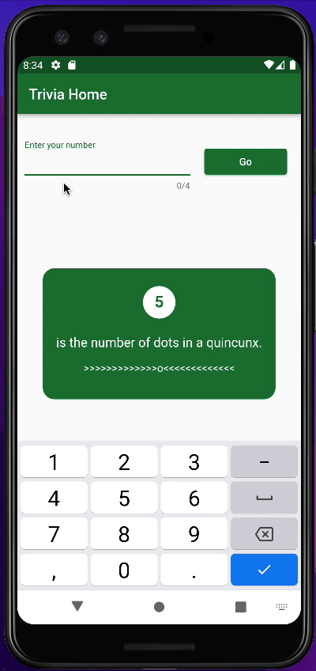
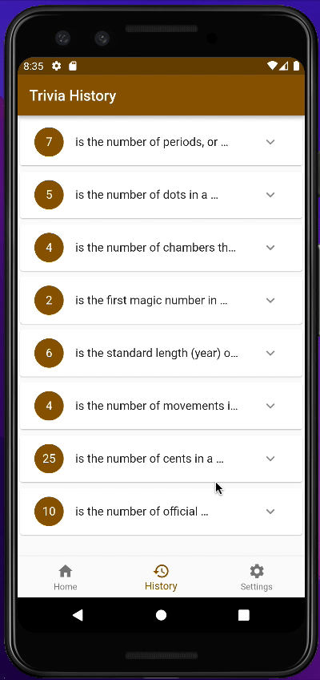

# NumberTriviaApp
A number trivia app built with flutter and dart using the number api. The number api can be located at http://numbersapi.com/.

The trivia app allow you to retrieve popular facts about integers from 0 - 9999.  It has a main tab, a history tab and a setting tab.
- The setting app allows you to select the amount of search history result to keep and the color theme of the app
- The history tab keeps the result history

### Dependencies
- flutter_colorpicker: ^1.0.3
- flutter_native_splash: ^2.2.16
- http: ^0.13.5
- provider: ^6.0.4
- shared_preferences: ^2.0.15
- flutter_launcher_icons: ^0.11.0

### Looks
Please see the gifs below to see how app looks and work:

App Preview & Settings Persistence:: 

     

Other Behaviours:

      

### TODO
- Persist search history data to disk and display at app startup